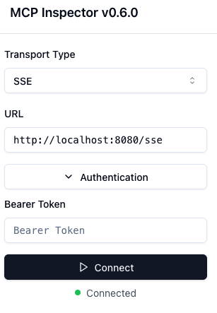

# MCP with OAuth

The sample server has been enhanced with OAuth, according
to [MCP draft spec > Authentication](https://spec.modelcontextprotocol.io/specification/draft/basic/authorization/).

## Getting started

Run the project with:

```
./mvnw spring-boot:run
```

Obtain a token by calling the `/oauth2/token` endpoint:

```shell
curl -XPOST "http://localhost:8080/oauth2/token" \
  --data grant_type=client_credentials \
  --user "oidc-client:secret"
# And copy-paste the access token
# Or use JQ:
curl -XPOST "http://localhost:8080/oauth2/token" \
  --data grant_type=client_credentials \
  --user "oidc-client:secret" | jq -r ".access_token"
```

Store that token, and then boot up the MCP inspector:

```shell
npx @modelcontextprotocol/inspector@0.6.0
```

In the MCP inspector, paste your token. Click connect, and voilà!



Note that the token is only valid for 5 minutes

## Implementation considerations

### Dependencies

In Spring, OAuth2 Support for MCP server means adding:

1. [Spring Security](https://docs.spring.io/spring-security/) (infrastructure for security)
2. [Spring Authorization Server](https://docs.spring.io/spring-authorization-server/) (issuing tokens)
3. [Spring Security: OAuth2 Resource Server](https://docs.spring.io/spring-security/reference/servlet/oauth2/resource-server/index.html#page-title) (
   authentication using tokens)

Note that Spring Auth Server does not support the reactive stack, so issuing tokens only works in Servlet.

### Configuration

All the configuration is in `SecurityConfiguration.java`, with some commentary of the beans are used for.

Users would need provide some configuration:

1. An RSA key pair for signing tokens. While a key pair could be generated at startup time, this would cause issues with
   horizontal scaling and invalidate all tokens on restart. See `JWKSource` and `JwtDecoder` beans.
1. An OAuth2 client registration that can request tokens, and for which the `client_id` and `client_secret` can be
   shared. In the case of frontend interactions where the user authorizes the Client with the Server ("yes I consent,
   Client can use my data from Server"), the Client needs to be known in advance by the Server, because the
   `redirect_uri` that point a user back to the Client must be on an allow-list on the server.
    1. OAuth supports "dynamic client registration", where the Client can self-register, but there still needs to be a
       way for the Server to authenticate this registration mechanism.
1. Some login mechanism for users, either an internal user store with form login or some federated login (think "sign
   in with Google").
1. Possibly some knobs and good default values to configure tokens (e.g. JWT vs Opaque tokens, token expiry, possible
   scopes).

The biggest pain point is the Client registration part.

### Next steps?

- Test with a proper MCP Client that supports OAuth2 login
- Play with dynamic client registration

